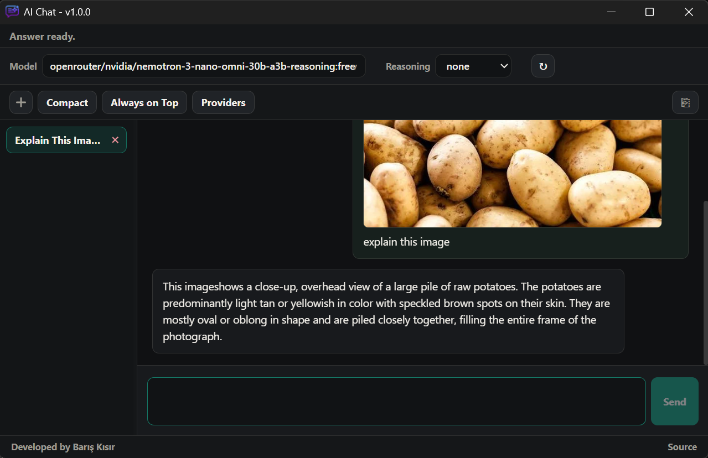

# AI Chat

AI Chat is a compact Windows-focused Tauri desktop client for Codex (OAuth), Claude (OAuth), and OpenAI-compatible chat APIs.



## Install

1. Download the latest release for Windows from [Releases](https://github.com/bariskisir/AIChat/releases/latest).
2. Install or extract the package.
3. Run **AI Chat**.

## Development

### Prerequisites

- [Rust](https://rustup.rs/) stable
- Node.js 22 or newer
- Visual Studio Build Tools on Windows

```bash
git clone https://github.com/bariskisir/AIChat
cd AIChat

cd frontend
npm install
npm run build
cd ..

cargo run
```

## License

MIT
