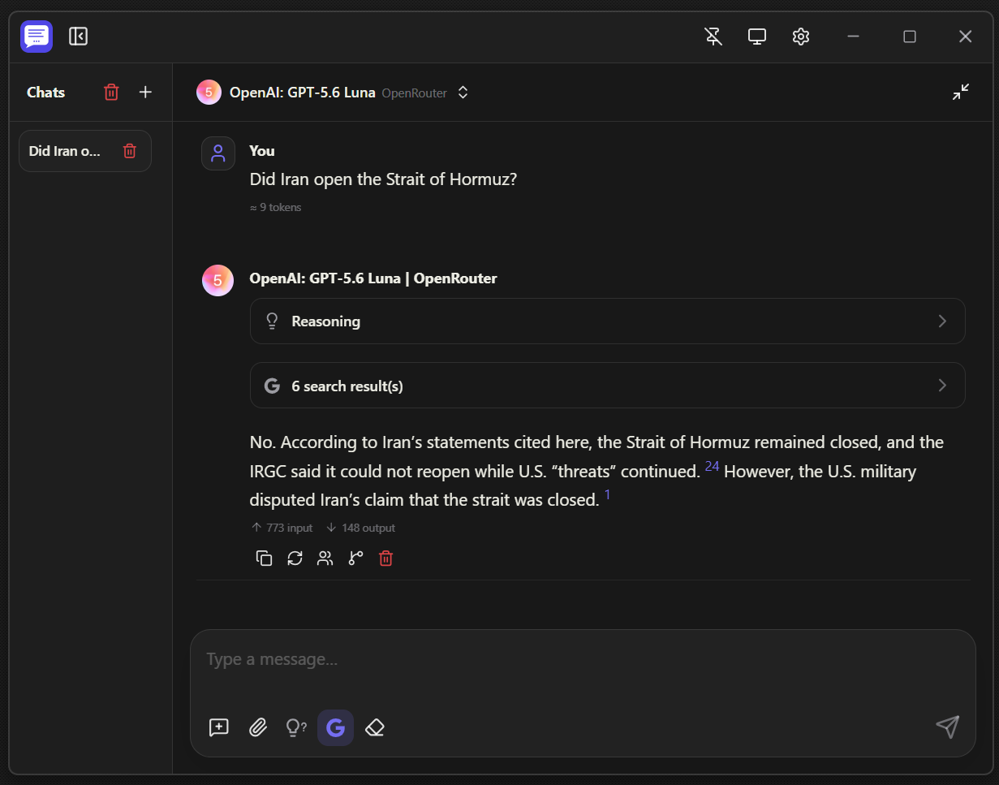
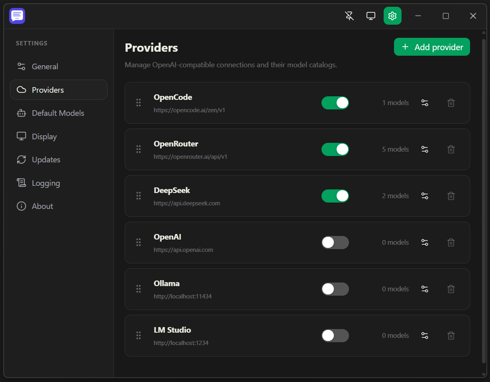

# AI Chat

AI Chat is an Electron desktop client for OpenAI-compatible APIs, ChatGPT, and Claude Web.




---

## Install

1. Download the latest release for your platform from [Releases](https://github.com/bariskisir/AIChat/releases/latest).
2. Install or extract the package.
3. Run **AI Chat**.

## Development

```bash
git clone https://github.com/bariskisir/AIChat.git
cd AIChat
npm i
npm run dev
```

## License

MIT
